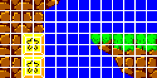
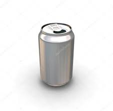
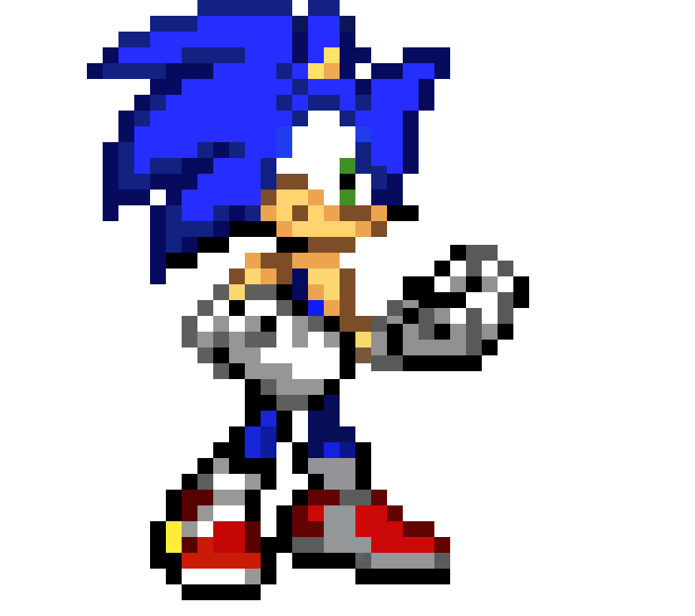

# martine

After Claudia from Eliot a long time ago, here is coming Martine.
A cli which converts JPEG or PNG image file into  SCR/PAL or Overscan  Amstrad CPC file screen.
Multi os, you can convert any pictures to Amstrad CPC Screen.
The files generated (.win, .scr, .ink) are compatible with [OCP art studio](http://www.cpc-power.com/index.php?page=detail&num=4963) and Impdraw V2 [i2](http://amstradplus.forumforever.com/t462-iMPdraw-v2-0.htm)

Martine tries to accelerate your game, demo animation development by organize and conversion of your graphical data.
All screens data are associated with basic programs launchers to quick display the output on real machines.

Output:
Martine generates a lot of differents files, which allow you to find the format and the data you will use.

files generated :  
 * .win or .scr sprite or screen files
 * .pal or .ink palette file (.ink will be generated if the -p option is set)
 * .txt ascii file with palettes values (firmware values and basic values), and screen byte values
 *  c.txt ascii file with palettes values (firmware values and basic values), and screen byte values by column
 * .json json file with palettes values (firmware values and basic values), and screen byte values
 * .bas launch to test the screen load on classic .scr 17ko 
 * _resized.png images files to ensure the resize action
 * _downgraded.png images files to ensure the downgraded palette action
 * _paletteink.png palette image describing the CPC old colors used
 * _palettepal.png palette image describing the CPC old colors used
 * _palettekit.png palette image describing the CPC plus colors used

additionnals options available : 
* -dsk will generate a dsk file and add all amsdos files will be added.
* -n will remove amsdos headers from the amsdos files
* -f will generate overscan screen amsdos file
* -p will generate a CPC plus screen amsdos file
* -h will generate sprite of x pixel high
* -w will generate sprite of x pixel wide
* -s to define the byte token will be replace the byte token in the ascii files
* -a to set the algorithm to downsize the image
* -m to define the screen mode 0,1,2
* -o to set the output directory (is not exists, martine will create the folder).
* -z compress the image .scr / .win (not overscan) using the algorithm.
* -zigzag will generate data output as zigzag.
* -scanlinesequence will generate the lines following the input sequence such as 0,7,1,2,3,4,5,6 for instance.
* -sla will rotate x column pixels from the left, those columns will be discarded  
* -sra will rotate x column pixels from the right, those columns will be discarded  
* -rra will rotate x column pixels from the right
* -rla will rotate x column pixels from the left
* -keephigh will rotate x line pixels to the top
* -keeplow will rotate x line pixels to the bottom
* -losthigh will rotate x line pixels to the top, those lines will be discarded 
* -lostlow will rotate x line pixels to the bottom, those lines will be discarded
* -sna copy output files in a new CPC image Sna.
* -reducer reducing color filter (3 gradients are available)
* -mask string
    	Mask to apply on each bit of the sprite (to apply an and operation on each pixel with the value #AA [in hexdecimal: #AA or 0xAA, in decimal: 170] ex: martine -i myimage.png -w 40 -h 80 -mask #AA -m 0 -maskand)
* -maskand 	Will apply an AND operation on each byte with the mask
* -maskor Will apply an OR operation on each byte with the mask
* -tilemap
    	Analyse the input image and generate the tiles, the tile map and gloabl schema.

hardware options (if you owns a M4 Card, you can transfert your results by Wifi to your CPC using those options) : 
* -host ip or dns name of your M4.
* -autoexec will execute the launcher or sna file on your remote CPC.
* -spritehard will generate 16x16 bits sprite hard for CPC plus.
* -splitrasters will generate a rastered screen 
* -reverse create a png image from your .scr .win file


To Install and compile
```
go get github.com/jeromelesaux/martine
cd $GOPATH/src/github.com/jeromelesaux/martine
go get 
go build
```

To get binary : 
[https://github.com/jeromelesaux/martine/releases](https//github.com/jeromelesaux/martine/releases)
<br>OS avaible : Linux, Macos X and Windows  

Usage and options : 

```
./martine
martine convert (jpeg, png format) image to Amstrad cpc screen (even overscan)
By Impact Sid (Version:0.25rc)
Special thanks to @Ast (for his support), @Siko and @Tronic for ideas
usage :

  -a int
    	Algorithm to resize the image (available :
    		1: NearestNeighbor (default)
    		2: CatmullRom
    		3: Lanczos
    		4: Linear
    		5: Box
    		6: Hermite
    		7: BSpline
    		8: Hamming
    		9: Hann
    		10: Gaussian
    		11: Blackman
    		12: Bartlett
    		13: Welch
    		14: Cosine
    		15: MitchellNetravali
    		 (default 1)
  -address string
    	Starting address to display sprite in delta packing (default "0xC000")
  -animate
    	Will produce an full screen with all sprite on the same image (add -i image.gif or -i *.png)
  -autoexec
    	Execute on your remote CPC the screen file or basic file.
  -delta
    	Delta mode: compute delta between two files (prefixed by the argument -df)
    		(ex: -delta -df file1.SCR -df file2.SCR -df file3.SCR).
    		(ex with wildcard: -delta -df file\?.SCR or -delta file\*.SCR
  -df value
    	scr file path to add in delta mode comparison. (wildcard accepted such as ? or * file filename.)
  -dithering int
    	Dithering algorithm to apply on input image
    	Algorithms available:
    		0: FloydSteinberg
    		1: JarvisJudiceNinke
    		2: Stucki
    		3: Atkinson
    		4: Sierra
    		5: SierraLite
    		6: Sierra3
    		7: Bayer2
    		8: Bayer3
    		9: Bayer4
    		10: Bayer8
    	 (default -1)
  -dsk
    	Copy files in a new CPC image Dsk.
  -egx1
    	Create egx 1 output cpc image overscan (option -f) or classical (mix mode 0 / 1).
    		(ex before generate two images one in mode 1 et one in mode 0
    		for instance : martine -i myimage.jpg -m 0 and martine -i myimage.jpg -m 1
    		: -egx1 -i 1.SCR -m 0 -pal 1.PAL -i2 2.SCR -o test -m2 1 -dsk)
    		or
    		(ex automatic egx from image file : -egx1 -i input.png -m 0 -o test -dsk)
  -egx2
    	Create egx 2 output cpc image overscan (option -f) or classical (mix mode 1 / 2).
    		(ex before generate two images one in mode 1 et one in mode 2
    		for instance : martine -i myimage.jpg -m 0 and martine -i myimage.jpg -m 1
    		: -egx2 -i 1.SCR -m 0 -pal 1.PAL -i2 2.SCR -o test -m2 1 -dsk)
    		or
    		(ex automatic egx from image file : -egx2 -i input.png -m 0 -o test -dsk)
  -extendeddsk
    	Export in a Extended DSK 80 tracks, 10 sectors 400 ko per face
  -f	Overscan mode (default no overscan)
  -flash
    	generate flash animation with two ocp screens.
    		(ex: -m 1 -flash -i input.png -o test -dsk)
    		or
    		(ex: -m 1 -flash -i input1.scr -pal input1.pal -m2 0 -i2 input2.scr -pal2 input2.pal -o test -dsk )
  -h int
    	Custom output height in pixels. (Will produce a sprite file .win) (default -1)
  -help
    	Display help message
  -host string
    	Set the ip of your M4.
  -i string
    	Picture path of the input file.
  -i2 string
    	Picture path of the second input file (flash mode)
  -info
    	Return the information of the file, associated with -pal and -win options
  -initprocess string
    	Create a new empty process file.
  -ink string
    	Path of the palette Cpc ink file. (Apply the input ink palette on the image)
  -iter int
    	Iterations number to walk in roll mode, or number of images to generate in rotation mode. (default -1)
  -iterx int
    	Number of tiles on a row in the input image. (default 1)
  -itery int
    	Number of tiles on a column in the input image. (default 1)
  -keephigh int
    	Bit rotation on the top and keep pixels (default -1)
  -keeplow int
    	Bit rotation on the bottom and keep pixels (default -1)
  -kit string
    	Path of the palette Cpc plus Kit file. (Apply the input kit palette on the image)
  -losthigh int
    	Bit rotation on the top and lost pixels (default -1)
  -lostlow int
    	Bit rotation on the bottom and lost pixels (default -1)
  -m int
    	Output mode to use :
    		0 for mode0
    		1 for mode1
    		2 for mode2
    		and add -f option for overscan export.
    		 (default -1)
  -m2 int
    	Output mode to use :
    		0 for mode0
    		1 for mode1
    		2 for mode2
    		mode of the second input file (flash mode) (default -1)
  -mask string
    	Mask to apply on each bit of the sprite (to apply an and operation on each pixel with the value #AA [in hexdecimal: #AA or 0xAA, in decimal: 170] ex: martine -i myimage.png -w 40 -h 80 -mask #AA -m 0 -maskand)
  -maskand
    	Will apply an AND operation on each byte with the mask
  -maskor
    	Will apply an OR operation on each byte with the mask
  -multiplier float
    	Error dithering multiplier. (default 1.18)
  -n	No amsdos header for all files (default amsdos header added).
  -o string
    	Output directory
  -p	Plus mode (means generate an image for CPC Plus Screen)
  -pal string
    	Apply the input palette to the image
  -pal2 string
    	Apply the input palette to the second image (flash mode)
  -processfile string
    	Process file path to apply.
  -quantization
    	Use additionnal quantization for dithering.
  -reducer int
    	Reducer mask will reduce original image colors. Available :
    		1 : lower
    		2 : medium
    		3 : strong
    	 (default -1)
  -remotepath string
    	Remote path on your M4 where you want to copy your files.
  -reverse
    	Transform .scr (overscan or not) file with palette (pal or kit file) into png file
  -rla int
    	Bit rotation on the left and keep pixels (default -1)
  -roll
    	Roll mode allow to walk and walk into the input file, associated with rla,rra,sra,sla, keephigh, keeplow, losthigh or lostlow options.
  -rotate
    	Allow rotation on the input image, the input image must be a square (width equals height)
  -rotate3d
    	Allow 3d rotation on the input image, the input image must be a square (width equals height)
  -rotate3dtype int
    	Rotation type :
    		1 rotate on X axis
    		2 rotate on Y axis
    		3 rotate reverse X axis
    		4 rotate left to right on Y axis
    		5 diagonal rotation on X axis
    		6 diagonal rotation on Y axis

  -rotate3dx0 int
    	X0 coordinate to apply in 3d rotation (default width of the image/2) (default -1)
  -rotate3dy0 int
    	Y0 coordinate to apply in 3d rotation (default height of the image/2) (default -1)
  -rra int
    	Bit rotation on the right and keep pixels (default -1)
  -s string
    	Byte statement to replace in ascii export (default is db), you can replace or instance by defb or byte
  -scanlinesequence string
    	Scanline sequence to apply on sprite. for instance :
    		martine -i myimage.jpg -w 4 -h 4 -scanlinesequence 0,2,1,3
    		will generate a sprite stored with lines order 0 2 1 and 3.

  -sla int
    	Bit rotation on the left and lost pixels (default -1)
  -sna
    	Copy files in a new CPC image Sna.
  -splitrasters
    	Create Split rastered image. (Will produce Overscan output file and .SPL with split rasters file)
  -spritehard
    	Generate sprite hard for cpc plus.
  -sra int
    	Bit rotation on the right and lost pixels (default -1)
  -tile
    	Tile mode to create multiples sprites from a same image.
  -tilemap
    	Analyse the input image and generate the tiles, the tile map and gloabl schema.
  -version
    	print martine's version
  -w int
    	Custom output width in pixels. (Will produce a sprite file .win) (default -1)
  -win string
    	Filepath of the ocp win file
  -z int
    	Compression algorithm :
    		1: rle (default)
    		2: rle 16bits
    		3: Lz4 Classic
    		4: Lz4 Raw
    	 (default -1)
  -zigzag
    	generate data in zigzag order (inc first line and dec next line for tiles)
```

Principles : 
Martine can be used in several modes : 
 * first mode : conversion of an input image into sprite (file .win), cpc screen (file .scr) and overscan screen (larger file .scr)
 * second mode : rotate line or column pixels of an input image (option -roll)
 * bulk conversion of a tiles page : each sprites of the same width and height will be converted to sprites (files .win, option -tile)
 * rotate an existing image, will produce images rotated
 * 3d rotate an existing image on an axis.
 * egx mode screen generation (screen which alternates 2 modes (0,1,2) each line).
 * delta packing, allows you to create your own animation using the less memory as possible, keeping the maximum of speed.
 * tilemap generate the map of tiles and sprites of the input map.
 * split raster to generate a rastered screen
 * flash to generate a flash screen

examples :
## 1. Simple screen conversion :
* convert samples/Batman-Neal-Adams.jpg 

  * in mode 0 
```martine -i samples/Batman-Neal-Adams.jpg -m 0```
  * in mode 1 
```martine -i samples/Batman-Neal-Adams.jpg -m 1```
  * in mode 2 
```martine -i samples/Batman-Neal-Adams.jpg -m 2```
  * in mode 0 in overscan : 
```martine -i samples/Batman-Neal-Adams.jpg -m 0 -f```
  * in mode 0 overscan for Plus series :
```martine -i samples/Batman-Neal-Adams.jpg -m 0 -f -p```
  * to get sprites (40 pixels wide)
```martine -i samples/Batman-Neal-Adams.jpg -m 0 -w 40```
  * roll mode to do an rra operation on the image (will create 16 sprites with a rra operation on the first pixels on the left)
	```martine -i samples/Batman-Neal-Adams.jpg -m 0 -w 40 -roll -rra 1 -iter 16```	

Samples : 
```martine -i samples/Batman-Neal-Adams.jpg -m 0 -f```

input       
 
 will resize the image and save it 

 

 after downgrade the colors palette : 

 

 results on a CPC emulator : 

 

 


## 2. Samples roll usage : 

```martine -i samples/rotate.png -m 0 -w 16 -h 16 -roll -rra 1 -iter 16```

input 

sames phasis reduce size and downgrade colors palette to CPC palette. 

after rotate the first pixels' column in 16 differents images : 

 
 
 
 
 
 
 
 
 
 
 
 
 
 
 
 

 with the same image, to rotate the pixels line : 

 ```martine -i samples/rotate.png -m 0 -w 16 -h 16 -roll -keephigh 2 -iter 16 ```

 will produce images : 

 
 
 
 
 
 
 
 
 
 
 
 
 
 
 
 

 

## 3. tile option :

this option will extract all the tiles from an image and generate the sprites files. 
sample usage : 
```martine -i samples/tiles.png -tile -w 64 -iterx 14 -itery 7 -m 0 ```

input 

This command will generate 14*7 sprites of 64 pixels large.
Warn, all sprite must have the same size.

 
 
 
 
 
 
 
 
 
 
 
 
 
 
 
 
 
 
 
 
 


## 4. rotation sprite : 
This option able to rotate the input image, iter will generate the number of images.
```martine -i images/coke.jpg -rotate -iter 16 -o test  -m 1 -w 32 -h 32```

Input : 

results : 


## 5. 3d rotation sprite : 
This option able to rotate the input image on an axis (X or Y and even on a diagonal), iter will generate the number of images. 
```./martine -m 0 -w 64 -h 64 -rotate3d -rotate3dtype 2 -o test/ -i images/sonic.png  -iter 12```

Input : 

Results: 

