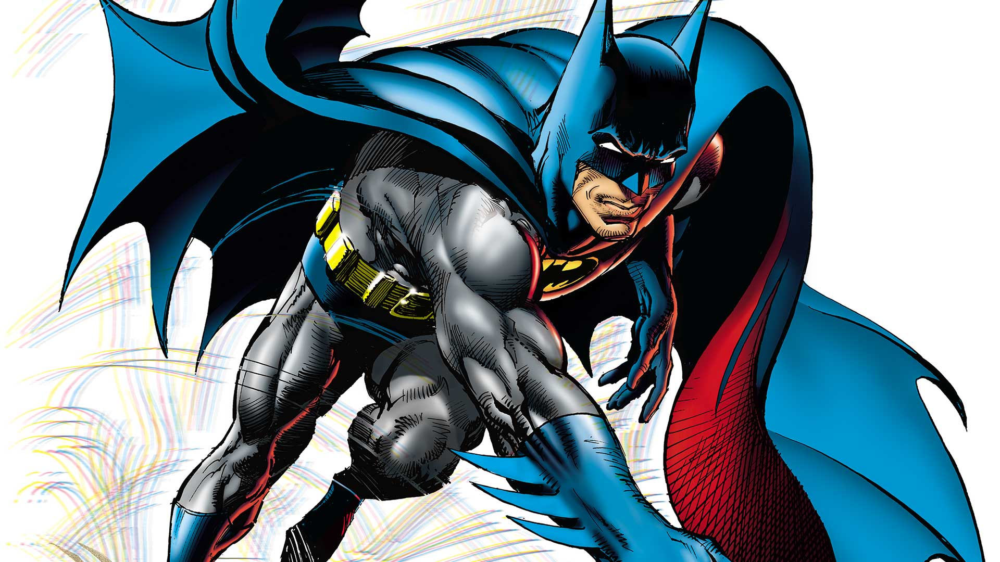
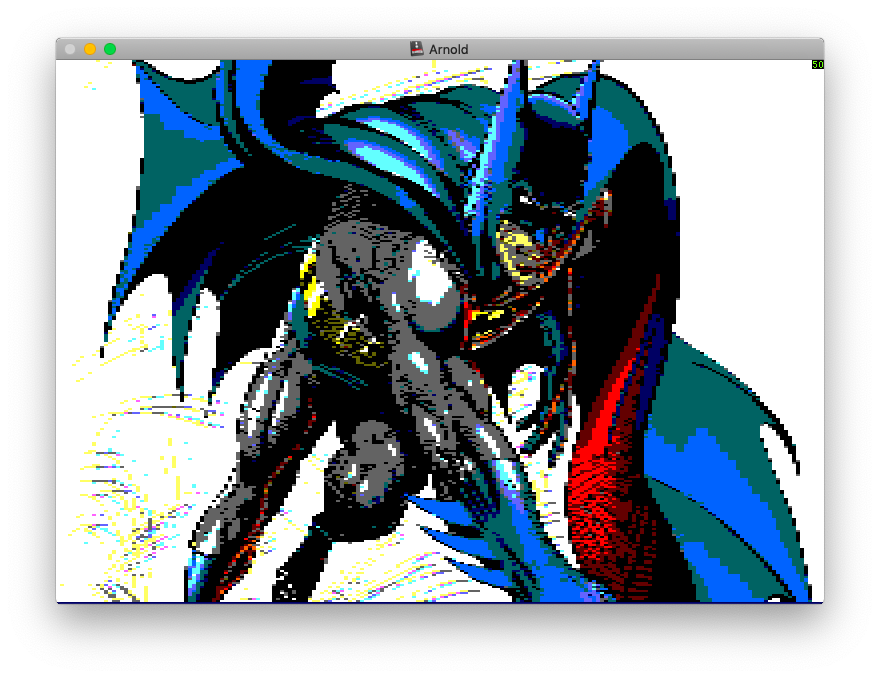

# martine

After Claudia from Eliot a long time ago, here is coming Martine.
A cli which converts JPEG or PNG image file into  SCR/PAL or Overscan  Amstrad CPC file screen.
Multi os, you can convert any pictures to Amstrad CPC Screen.
The files generated (.win, .scr, .ink) are compatible with [OCP art studio](http://www.cpc-power.com/index.php?page=detail&num=4963) and Impdraw V2 [i2](http://amstradplus.forumforever.com/t462-iMPdraw-v2-0.htm)

To Install and compile
```
go get github.com/jeromelesaux/martine
cd $GOPATH/src/github.com/jeromelesaux/martine
go get 
go build
```

To get binary : 
[https//github.com/jeromelesaux/martine/releases](https//github.com/jeromelesaux/martine/releases)
<br>OS avaible : Linux, Macos X and Windows  

Usage and options : 

```
./martine 
martine convert (jpeg, png format) image to Amstrad cpc screen (even overscan)
By Impact Sid (Version:0.6Alpha)
Special thanks to @Ast (for his support), @Siko and @Tronic for ideas
usage :

  -a int
    	Algorithm to resize the image (available : 
    		1: NearestNeighbor (default)
    		2: CatmullRom
    		3: Lanczos
    		4: Linear
    		5: Box
    		6: Hermite
    		7: BSpline
    		8: Hamming
    		9: Hann
    		10: Gaussian
    		11: Blackman
    		12: Bartlett
    		13: Welch
    		14: Cosine
    		 (default 1)
  -dsk
    	Copy files in a new CPC image Dsk.
  -f	Overscan mode (default no overscan)
  -h int
    	Custom output height in pixels. (default -1)
  -help
    	Display help message
  -i string
    	Picture path of the input file.
  -info
    	Return the information of the file, associated with -pal and -win options
  -iter int
    	Iterations number to walk in tile mode (default -1)
  -keephigh int
    	bit rotation on the top and keep pixels (default -1)
  -keeplow int
    	bit rotation on the bottom and keep pixels (default -1)
  -losthigh int
    	bit rotation on the top and lost pixels (default -1)
  -lostlow int
    	bit rotation on the bottom and lost pixels (default -1)
  -m int
    	Output mode to use :
    		0 for mode0
    		1 for mode1
    		2 for mode2
    		and add -f option for overscan export.
    		 (default -1)
  -n	no amsdos header for all files (default amsdos header added).
  -o string
    	Output directory
  -p	Plus mode (means generate an image for CPC Plus Screen)
  -pal string
    	Apply the input palette to the image
  -rla int
    	bit rotation on the left and keep pixels (default -1)
  -roll
    	Roll mode allow to walk and walk into the input file, associated with rla,rra,sra,sla, keephigh, keeplow, losthigh or lostlow options.
  -rra int
    	bit rotation on the right and keep pixels (default -1)
  -s string
    	Byte statement to replace in ascii export (default is BYTE), you can replace or instance by defb
  -sla int
    	bit rotation on the left and lost pixels (default -1)
  -sra int
    	bit rotation on the right and lost pixels (default -1)
  -tile
    	Tile mode to create multiples sprites from a same image.
  -w int
    	Custom output width in pixels. (default -1)
  -win string
    	Filepath of the ocp win file
```

examples :

* convert samples/Batman-Neal-Adams.jpg 

  * in mode 0 
```martine -i samples/Batman-Neal-Adams.jpg -m 0```
  * in mode 1 
```martine -i samples/Batman-Neal-Adams.jpg -m 1```
  * in mode 2 
```martine -i samples/Batman-Neal-Adams.jpg -m 2```
  * in mode 0 in overscan : 
```martine -i samples/Batman-Neal-Adams.jpg -m 0 -f```
  * in mode 0 overscan for Plus series :
```martine -i samples/Batman-Neal-Adams.jpg -m 0 -f -p```
  * to get sprites (40 pixels wide)
```martine -i samples/Batman-Neal-Adams.jpg -m 0 -w 40```
  * roll mode to do an rra operation on the image (will create 16 sprites with a rra operation on the first pixels on the left)
	```martine -i samples/Batman-Neal-Adams.jpg -m 0 -w 40 -roll -rra 1 -iter 16```	

Samples : 
```martine -i samples/Batman-Neal-Adams.jpg -m 0 -f```

input       
 
 will resize the image and save it 

 

 after downgrade the colors palette : 

 

 results on a CPC emulator : 

 


Samples roll usage : 

```martine -i samples/rotate.png -m 0 -w 16 -h 16 -roll -rra 1 -iter 16```

input 

sames phasis reduce size and downgrade colors palette to CPC palette. 

after rotate the first pixels' column in 16 differents images : 

 
 
 
 
 
 
 
 
 
 
 
 
 
 
 
 
